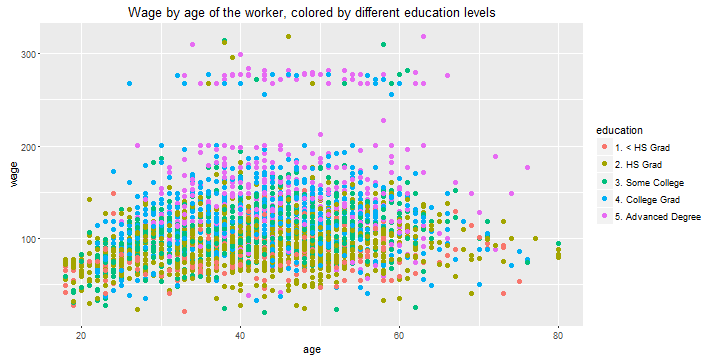

Wagedata
========================================================
author: Alberto Pellegata
date: 2016-04-21

Content of the presentation 
========================================================

  1. Objective
  2. Dataset
  3. Exploring our dataset
  4. Concept of the application
  5. Outcome / results

(1) Objective 
========================================================

We set up this effort to generate an interactive web-based application that would enable us to quantify and get insights from the worker perspective (i.e. Income) on a few (well known) factors that are statistically relevant in determining the actual wage level of individual workers.

This presentation serves as complementary document to the application itself which is currently deployed onto shinyapps.io servers. 

To reach the application via your favourite web browser you can [click here](https://semola2006.shinyapps.io/dataproduct/)

(2) The dataset
========================================================

We will work with a popular R dataset: Wage. You can upload it in R via the ISLR library. It contains wage and other relevant information for a group of 3,000 workers in the Mid-Atlantic region. Data was manually assembled by Steve Miller, of Open BI (www.openbi.com), from the March 2011 Supplement to Current Population Survey data. 

The dataset is composed of 3000 observation and 12 variables as follows:


```
 [1] "year"       "age"        "sex"        "maritl"     "race"      
 [6] "education"  "region"     "jobclass"   "health"     "health_ins"
[11] "logwage"    "wage"      
```

In our analysis and model we will focus on a selection of those: age of the workeker, education, race, jobclass and finally wage.

(3) Exploring the dataset
========================================================

We will visualize Wage level on y axis and age of the workers on x axis, showing the association with other variables such as i) education, ii) race and iii) jobclass. 
This is just a static view of what you will get to see in the application... there you have the plus of interaction!




(4) Concept of the application
========================================================

The application is designed to make interactive use of the dataset in two ways:

   1. Display graphically how some variables are associated to wage level
   2. Use a linear model to predict level of wage based on input provided 


The user interface is split in two main sections (top / bottom) to reflect those two functionalities.

We only put one Submit button to refresh the calculations, and we placed it at the very bottom of the page.

(5) Outcome/results
========================================================

In terms of scientific insights... Sorry, I think our model will not run for the next Nobel prize in economics! 

THANKS FOR READING! 

YOUR EVALUATION FEEDBACK IS WELCOME!


